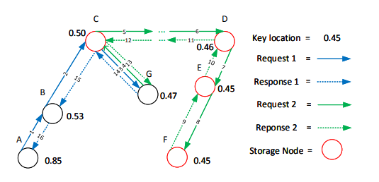
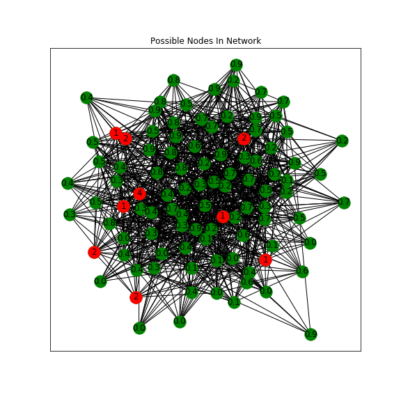

# DarknetAnalyze

Analyze famous darknet Tor and Freenet via Python.

    * [DarknetAnalyze](#darknetanalyze)
        * [Introduction of Freenet](#introduction-of-freenet)
            * [Overlay Network](#overlay-network)
            * [Routing](#routing)
            * [How Anonymity Works](#how-anonymity-works)
        * [Flow Analysis](#flow-analysis)
            * [Active Network Flow Analysis of Tor](#active-network-flow-analysis-of-tor)
            * [Passive Network Flow Analysis of Tor](#passive-network-flow-analysis-of-tor)
            * [Active Network Flow Analysis of Freenet](#active-network-flow-analysis-of-freenet)
            * [Passive Network Flow Analysis of Freenet](#passive-network-flow-analysis-of-freenet)
        * [Simulating the Passive Attack to Freenet](#simulating-the-passive-attack-to-freenet)

## Introduction of Freenet 

### Overlay Network


Notation:

- Freenet: A distribute data store and retrieve system which protects the anonymity of both reader and writer.
- Node: A member host machine which contributes some disk space and network bandwidth.
- Location：A float number between [0,1] as a cycle with 16 significant digits, which is used to organize both the nodes and data store.
- Insertion：Insert file into Freenet.
- Retrieve：Retrieve file from Freenet.
- Binary File Key：A binary string used to insert and retrieve file in Freenet, similar as URI in internet.
- FNP: Freenet Protocol.
- HTL: hops to live, a field in FNP message, working similar as TTL in IP. Mainly used to restrain the tarnsfer length of a packet.
- UID: unique identifier, yet another field in FNP message, which is used to identify an FNP message, avoid loop in routing and find path when backtrace response.

**Location**：


**Freenet URI:**


**The File Organization Manner**：


### Routing


Network Typology —— based on small-world network.

**Retrieve**：


Routing Algorithm —— depth first search via location.

**Insertion**：




Insert a message into network randomly, the location value of the message is 0.2950809848542828, inserted at:

```text
store at location 0.2951634042520589
store at location 0.2911546594280774
store at location 0.3000989833987089
store at location 0.29382775921623394
```

**Retrieve newly inserted file from different locations:**：


Because of the redundancy store policy, a file can be retrieved from different locations.

### How Anonymity Works

Mainly depends on routing algorithm:

- Each request routing via location rather than IP address, each node only knows the physical knowledge of its direct neighbors.
- HTL is not perfectly decreased one each step. It has chance remain its value at max(18) or 1 with probability of 50% and 75% respectively.
- Each request message can only be identitied by UID, UID will change when HTL at 15 during the insertion process.

## Flow Analysis

### Active Network Flow Analysis of Tor


Given the information as follows:

```
# pub represents RSA public key，pri represents RSA private key
Alice: alice.pub alice.pri
Enter: enter.pub enter.pri
Delay: delay.pub delay.pri
Exit: exit.pub exit.pri
```

When Alice want to use the link, she encryted her messages:

$$ En(msg) = En_{enter.pub}(En_{delay.pub}(En_{exit.pub}(msg))))$$

Then the packets transfer via the constructed link. Decryption happens at each node by its RSA private key, and become the original form at the exit node:


> Network flow watermarking is a type of active TA in which a watermark is embedded into selected flows in order to recognise that flows at specific points in the network.

An example of network flow watermark:

- 1000: sleep time(millisecond)
- 101001000: pattern of watermark, when the value is 1 send a packet, else sleep specific time. This pattern means sleep 1, 2, 3 seconds when send a packet in a cycle.


Lines depicted with different time interval and patterns:


### Passive Network Flow Analysis of Tor

Similay as network flow watermark other than monitor the network flow without midifying it.

Passive network analysis of Tor:


### Active Network Flow Analysis of Freenet

Add time interval in upload side(the slope is becoming smaller, means that the sending rate is decreasing), but the download side receiving rate almost has no change.


### Passive Network Flow Analysis of Freenet

Because the Freenet uses UDP as its transport layer protocol, and the network flow during each delay is strong encrypted, so we monitor the internal network flow in Freenet node by user defined log.

The location distribution of request in a node:


The HTL distribution of request in a node:


## Simulating the Passive Attack to Freenet

The network typology is similar as the begining presentation, and we suppose that there are 30% of nodes are controled by adversary:


The blue node represents evil nodes, yellow represents target nodes. The evil nodes can record the (uid, htl, location) tuple of each request through them.

Simulate process that sending requests from the target node, and calculate the most frequently shown nodes by analysis the log: 

```text
target: 0.00028349557720475094

[(0.48121497126960155, 4),
 (0.5298683372650849, 2),
 (0.00028349557720475094, 2),
 (0.4708016549364684, 2),
 (0.2585449757184801, 2),
 (0.021666505332342934, 1),
 (0.4707638359586981, 1),
 (0.5195603388432348, 1),
 (0.15303569226992653, 1)]
```



if target node shows in the most common three, than defines it as exposed.

Simulate the process five turns, each turn runs 100 times, and each time target node send 1 request message. Draw pictures as follows:


change the time to 10000:


keep the time as 10000, the inner request message count is (1, 2, 3, 4, 5):


The expose rate decreases as the message count increases because the core principle of Freenet is hide in crowds, if there are more member's behavior similar as you, than you are more difficult to be find out.
